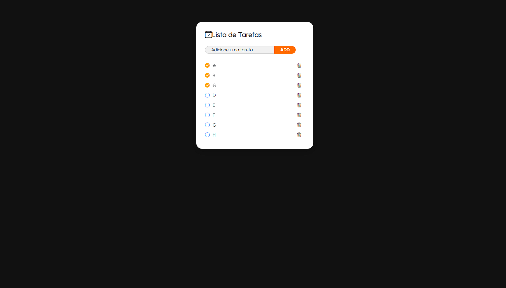

<h1 align="center" style="font-weight: bold;">Todo List</h1>

    <b>Projeto desenvolvido em Java Spring. Uma api de lista de tarefas, que permite criar, atualizar e deletar tarefas. Frontend básico feito com HTML e CSS.</b>

<h2> 💻 Technologies</h2>

- Java 25
- Maven
- Spring Boot(Web, JPA, Lombok)
- PostgreSQL
- Thymeleaf
- Bootstrap 5.3
- CSS
- HTML

<h2>📍 API Endpoints</h2>

| route                     | description                                             |
|---------------------------|---------------------------------------------------------|
| <kbd>GET /</kbd>          | Retorna todas as tarefa existentes                      |
| <kbd>POST /add</kbd>      | Adiciona uma tarefa à lista                             |
| <kbd>GET /update/id</kbd> | Atualiza o status da tarefa para completa ou imcompleta |
| <kbd>GET /delete/id</kbd> | Deleta a tarefa desejada                                |

